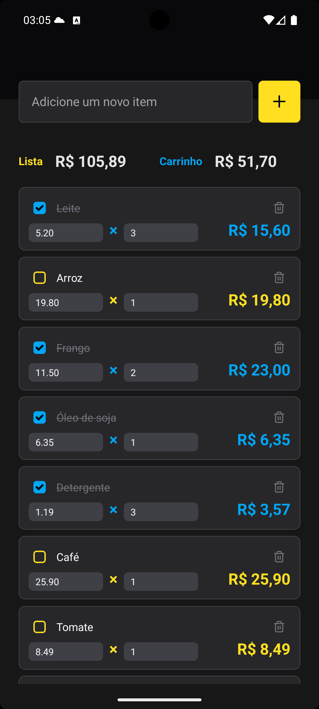

<h1>
  <table align="center">
    <tr>
      <td>Mercaduladora</td>
    </tr>
  </table>
</h1>

<h3 align="center">
Calculadora para organizar compras do mercado
</h3>

<p align="center" margin-top="25px" >
  
  
  
</p>


## :mag: Visão Geral
A aplicativo para registrar agilizar o soma dos produtos dentro do mercado para saber o total que irá ter no carrinho e ao mesmo tempo saber quais itens já foram adicionados.

## :camera: Preview
<div align="center">
  &nbsp;
  &nbsp;
  &nbsp;
</div>

## :rocket: Funcionalidades

- Memorização dos itens adicionados na memória do diapositivo.
- Multiplicação dos preços e soma do total da compra
- Marcação dos itens da lista adicionados no carrinho

## :computer: Requisitos do Sistema

- Node.js (v22.0.0 ou superior)
- expo-cli (v16.19.2 ou superior)

## :arrow_down: Instalação

1. Clone o repositório:

```bash
git clone https://github.com/leonardondev/mercaduladora.git
```

2. Navegue para a pasta do projeto:

```bash
cd mercaduladora
```

3. Instale as dependências:

```bash
npm install
```

## :rocket: Executando o Projeto

Para executar o projeto, utilize o seguinte comando para iniciar a versão de desenvolvimento:

```bash
# Instale as dependências necessárias
npm install

# Agora inicie a aplicação - Um QR Code será exibido no Terminal
npm run start

# Eu seu celular instale o aplicativo Expo Go - Ele é gratuito.

# Abra o Expo Go que acabou de instalar, e então escaneie o QR Code através do aplicativo.

# A aplicação então será exibida de forma 100% funcional diretamente em seu celular.
```

## :wrench: Tecnologias Utilizadas

- [React Native](https://reactnative.dev/)
- [TypeScript](https://www.typescriptlang.org/)
- [Async Storage](https://reactnative.dev/docs/asyncstorage)
- [Zustand](https://zustand-demo.pmnd.rs/)
- Outras dependências listadas no `package.json`

## :handshake: Contribuição

Contribuições são bem-vindas! Se você encontrou algum bug ou tem alguma melhoria para sugerir, por favor, abra uma nova "Issue" ou envie um "Pull Request".

## :scroll: Licença

Este projeto está licenciado sob a [MIT License](https://opensource.org/licenses/MIT).
Veja aqui [LICENSE](/LICENSE) para mais detalhes
